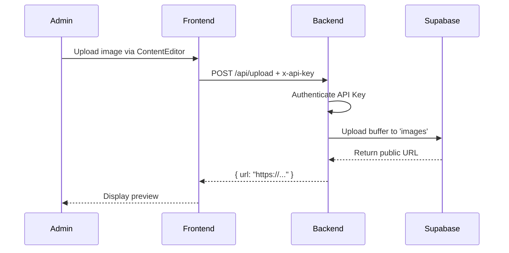

# Data Flow

```mermaid
sequenceDiagram
    participant Admin
    participant Frontend
    participant Backend
    participant Supabase
    
    Admin->>Frontend: Upload image via ContentEditor
    Frontend->>Backend: POST /api/upload + x-api-key
    Backend->>Backend: Authenticate API Key
    Backend->>Supabase: Upload buffer to 'images'
    Supabase-->>Backend: Return public URL
    Backend-->>Frontend: { url: "https://..." }
    Frontend-->>Admin: Display preview
```