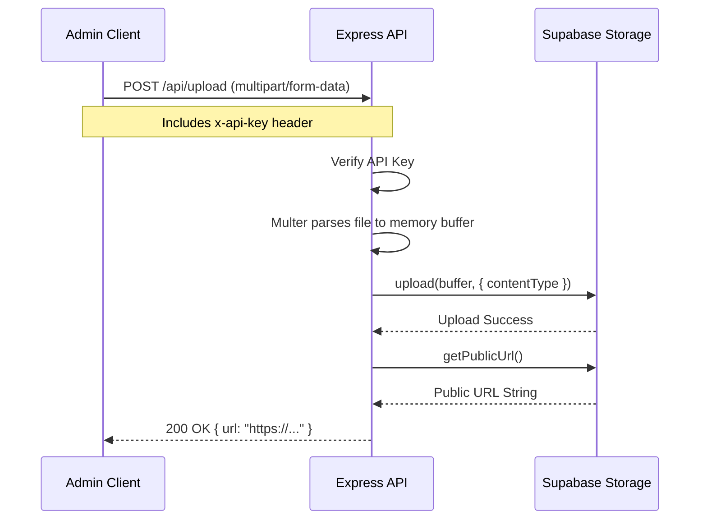

# Data Flow

## Image Upload Sequence
When an administrator uploads a new image for a character or event, the following flow occurs entirely in memory to optimize speed and security:

```mermaid
sequenceDiagram
    participant Admin as Admin Client
    participant Backend as Express API
    participant Storage as Supabase Storage
    
    Admin->>Backend: POST /api/upload (multipart/form-data)
    Note over Admin,Backend: Includes x-api-key header
    Backend->>Backend: Verify API Key
    Backend->>Backend: Multer parses file to memory buffer
    Backend->>Storage: upload(buffer, { contentType })
    Storage-->>Backend: Upload Success
    Backend->>Storage: getPublicUrl()
    Storage-->>Backend: Public URL String
    Backend-->>Admin: 200 OK { url: "https://..." }
```