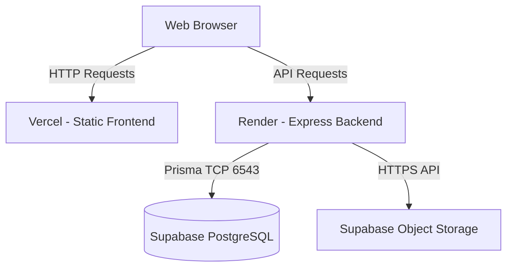

# System Architecture

- **Frontend:** Vercel (React, Vite, TanStack Router)
- **Backend:** Render (Express, Node.js)
- **Database:** Supabase (PostgreSQL)

```mermaid
flowchart TD
    Client[Web Browser] -->|HTTP Requests| Vercel[Vercel - Static Frontend]
    Client -->|API Requests| Render[Render - Express Backend]
    Render -->|Prisma TCP 6543| SupabaseDB[(Supabase PostgreSQL)]
    Render -->|HTTPS API| SupabaseStorage[Supabase Object Storage]
```