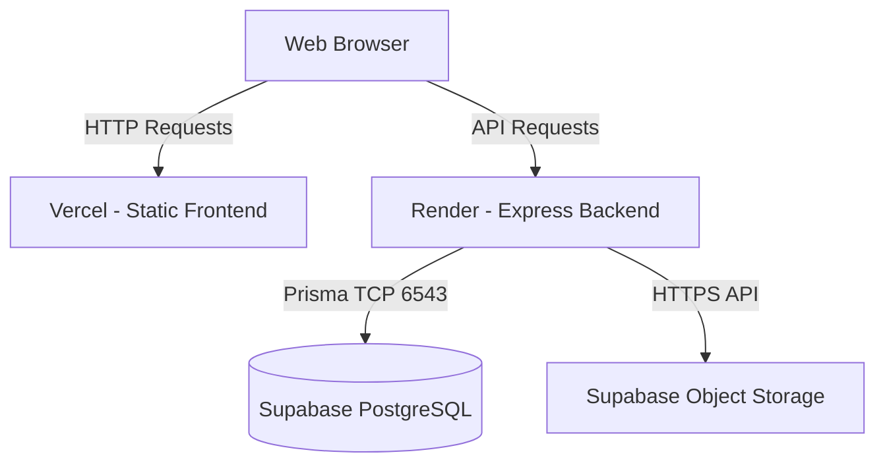

# System Architecture

The Amazing Web utilizes a decoupled, modern full-stack architecture.

## Frontend (Vercel)
- **Framework**: React 18, Vite
- **Routing**: TanStack Router (File-based routing)
- **3D Engine**: `react-force-graph-3d` (Three.js wrapper)
- **Styling**: Tailwind CSS
- **State Management**: TanStack Query (React Query) for server state.

## Backend (Render)
- **Runtime**: Node.js
- **Framework**: Express.js
- **ORM**: Prisma
- **File Handling**: Multer (in-memory buffer parsing)

## Database & Storage (Supabase)
- **Database**: PostgreSQL with Connection Pooling (PgBouncer) on port 6543.
- **Storage**: Supabase Object Storage ('images' bucket).

