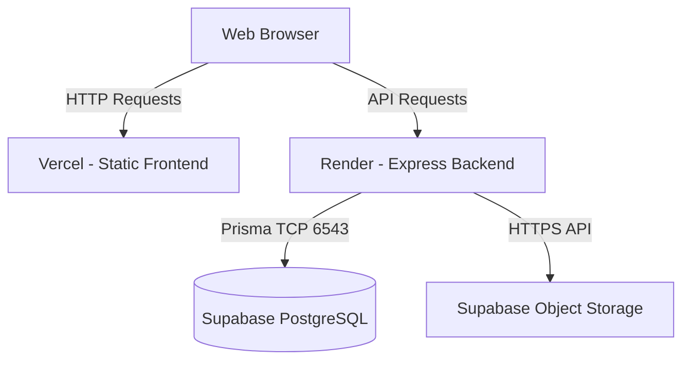
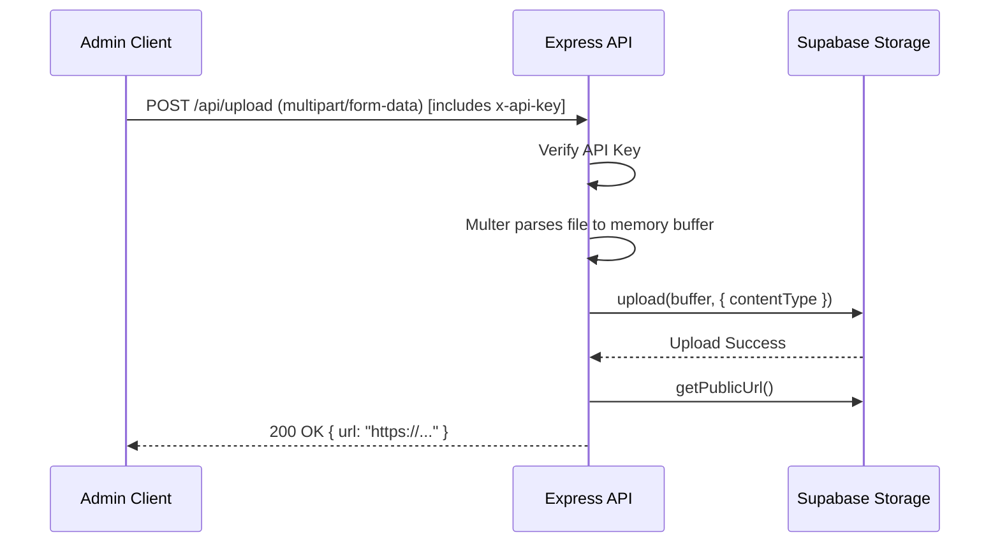

# 2. Architecture & Data Flow

## System Architecture
The Amazing Web utilizes a decoupled, modern full-stack architecture to maximize edge caching for the frontend while maintaining a persistent connection pool for the backend.

- **Frontend (Vercel)**: React 18, Vite, TanStack Router, `react-force-graph-3d`, Tailwind CSS.
- **Backend (Render)**: Node.js, Express.js, Prisma ORM, Multer.
- **Database (Supabase)**: PostgreSQL with PgBouncer connection pooling on port 6543, plus Supabase Object Storage.

## Image Upload Data Flow
When an administrator uploads a new image for a character or event, the flow occurs entirely in-memory:

