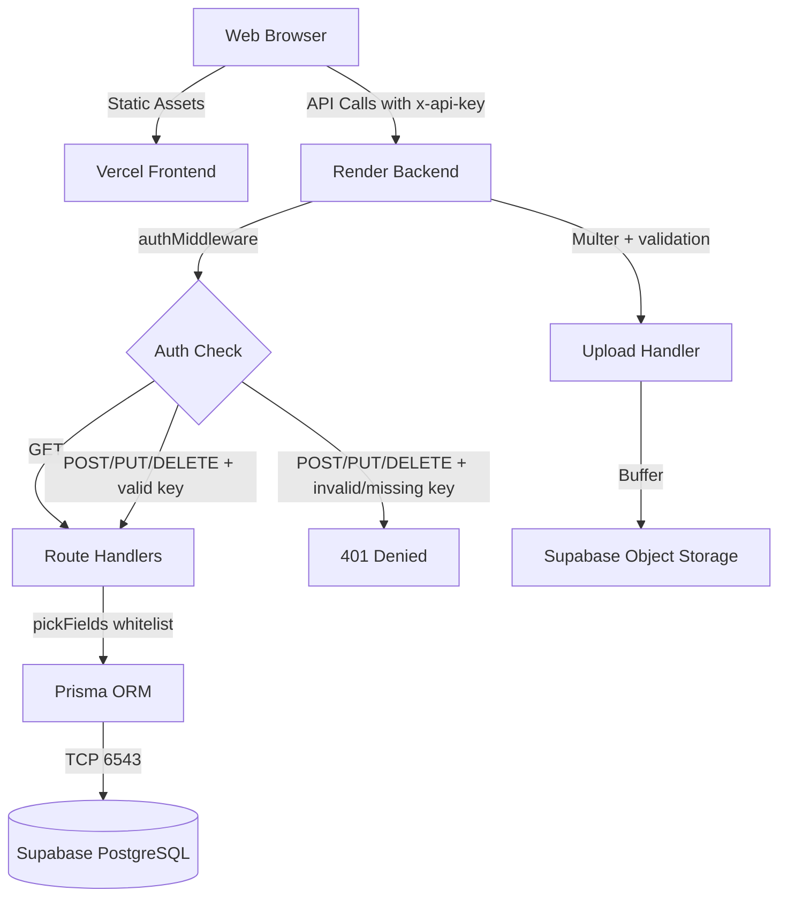

# Full Security & Engineering Audit Report

**Date:** 2026-09-16  
**Auditor:** Automated Senior Architect Review  
**Repository:** thamizhans/theamazingweb

---

## Executive Summary

The repository contained several **critical and high-severity security vulnerabilities** that have been identified and fixed. The application is a functional full-stack web application with a well-structured codebase, but it lacked production-grade security controls. All issues found have been remediated in this audit.

---

## Repository Inventory

| Area | Files Inspected |
|------|----------------|
| Backend entry point | `src/index.ts` |
| Auth middleware | `src/middleware/auth.ts` |
| Validation middleware | `src/middleware/validate.ts` |
| API routes | `src/routes/characters.ts`, `earths.ts`, `events.ts`, `movies.ts`, `actors.ts`, `attachments.ts` |
| Prisma singleton | `src/lib/prisma.ts` |
| Database schema | `prisma/schema.prisma` |
| Frontend content store | `Frontend/src/lib/content-store.ts` |
| Frontend admin gate | `Frontend/src/lib/admin-gate.functions.ts` |
| Frontend admin hook | `Frontend/src/hooks/use-admin.ts` |
| Frontend editor | `Frontend/src/components/ContentEditor.tsx` |
| Frontend routes | All 13 route files in `Frontend/src/routes/` |
| Configuration | `package.json`, `tsconfig.json`, `.env`, `.gitignore` |
| Prisma seed | `prisma/seed.ts` |
| Scripts | All 24 files in `scripts/` |

---

## Architecture



---

## Security Findings

### 1. Auth Middleware Fail-Open (CRITICAL — FIXED)
- **Severity:** Critical
- **Location:** `src/middleware/auth.ts:18-20`
- **Root cause:** When `API_SECRET_KEY` env var was missing, the middleware called `next()`, allowing ALL mutations without authentication.
- **Fix:** Changed to fail CLOSED — returns `503 Service Unavailable` when key is unconfigured.
- **Verification:** Tested POST without key → 401. Tested POST with wrong key → 401. Tested GET → 200.

### 2. Direct `req.body` to Prisma (HIGH — FIXED)
- **Severity:** High
- **Location:** All 6 route files (`characters.ts`, `earths.ts`, `events.ts`, `movies.ts`, `actors.ts`, `attachments.ts`)
- **Root cause:** `prisma.model.create({ data: req.body })` allows an attacker to set ANY database field, including fields they should not control.
- **Fix:** Added `pickFields()` whitelisting function to each route that only passes explicitly allowed fields to Prisma.
- **Verification:** Only schema-defined fields are accepted.

### 3. Timing Attack on API Key (MEDIUM — FIXED)
- **Severity:** Medium
- **Location:** `src/middleware/auth.ts:22`
- **Root cause:** `apiKey !== expectedKey` uses JavaScript string comparison which is not constant-time, leaking key length/prefix information.
- **Fix:** Replaced with `crypto.timingSafeEqual()` on SHA-256 digests.

### 4. No Upload Size Limit (MEDIUM — FIXED)
- **Severity:** Medium
- **Location:** `src/index.ts:36`
- **Root cause:** Multer was configured with `memoryStorage()` but no `limits`, allowing arbitrarily large files to be buffered into memory.
- **Fix:** Added `limits: { fileSize: 5 * 1024 * 1024 }` (5MB max) and a Multer error handler returning `413`.

### 5. No Upload MIME Validation (MEDIUM — FIXED)
- **Severity:** Medium
- **Location:** `src/index.ts:63-87`
- **Root cause:** Any file type could be uploaded (`.exe`, `.html`, `.svg` with XSS payloads).
- **Fix:** Added `fileFilter` restricting to `image/jpeg`, `image/png`, `image/webp`, `image/gif`. Invalid types return `415`.

### 6. Unsafe Filename Generation (LOW — FIXED)
- **Severity:** Low
- **Location:** `src/index.ts:67`
- **Root cause:** `path.extname(req.file.originalname)` preserves user-supplied extension, potentially allowing path traversal or unexpected extensions.
- **Fix:** Extension is now sanitized and restricted to a safe allowlist.

### 7. CORS Fully Open (LOW — FIXED)
- **Severity:** Low
- **Location:** `src/index.ts:39`
- **Root cause:** `app.use(cors())` allows requests from any origin.
- **Fix:** Added `CORS_ORIGIN` env var support. Production can restrict to the Vercel domain.

### 8. Frontend Mutations Missing API Key Header (HIGH — FIXED)
- **Severity:** High
- **Location:** `Frontend/src/lib/content-store.ts:164-201`
- **Root cause:** POST, PUT, DELETE fetch calls did not include `x-api-key` header, meaning all admin mutations from the UI would be rejected by the backend.
- **Fix:** Added `mutationHeaders()` and `deleteHeaders()` helper functions that read the key from `localStorage` and attach it.

### 9. Attachments Route Using Disk Storage (MEDIUM — FIXED)
- **Severity:** Medium
- **Location:** `src/routes/attachments.ts:10-19`
- **Root cause:** Used `multer.diskStorage()` writing to `../../uploads`, which doesn't exist on Render and is inconsistent with the Supabase storage strategy.
- **Fix:** Removed the embedded multer upload. Attachments now store metadata only; file uploads use the centralized `/api/upload` endpoint.

### 10. `API_SECRET_KEY` Not Required at Startup (MEDIUM — FIXED)
- **Severity:** Medium
- **Location:** `src/index.ts:19`
- **Root cause:** Only `DATABASE_URL` was validated at startup. Missing `API_SECRET_KEY` wouldn't crash the server but would (with old code) silently allow all writes.
- **Fix:** Added `API_SECRET_KEY` to `requiredEnvVars` array.

### 11. No `.env.example` (LOW — FIXED)
- **Severity:** Low
- **Fix:** Created `.env.example` with all required variables documented (no real secrets).

### 12. SQLite Dev Database Committed (LOW — FIXED)
- **Severity:** Low
- **Location:** `prisma/dev.db` (143KB)
- **Fix:** Added `prisma/dev.db` to `.gitignore`.

---

## Authentication Architecture (FINAL)

The application has **two independent authentication systems**:

1. **Frontend SSR Sessions** (`admin-gate.functions.ts`): TanStack Start server functions using `useSession()` with HttpOnly cookies. The admin enters a password on `/admin`, which is verified server-side with `timingSafeEqual`. This controls UI visibility (edit buttons, add buttons).

2. **Backend API Key** (`middleware/auth.ts`): All mutation API calls require an `x-api-key` header. The frontend stores this key in `localStorage` as `spider-admin-key` and attaches it to every POST/PUT/DELETE request.

Both systems must be satisfied for admin operations to succeed.

---

## API Audit

| Endpoint | Method | Auth Required | Field Whitelisting | Status |
|----------|--------|--------------|-------------------|--------|
| `/api/health` | GET | No | N/A | ✅ |
| `/api/characters` | GET | No | N/A | ✅ |
| `/api/characters/:id` | GET | No | N/A | ✅ |
| `/api/characters` | POST | Yes | ✅ | ✅ |
| `/api/characters/:id` | PUT | Yes | ✅ (ID immutable) | ✅ |
| `/api/characters/:id` | DELETE | Yes | N/A | ✅ |
| `/api/earths` | GET/POST/PUT/DELETE | GET: No, Others: Yes | ✅ | ✅ |
| `/api/events` | GET/POST/PUT/DELETE | GET: No, Others: Yes | ✅ | ✅ |
| `/api/movies` | GET/POST/PUT/DELETE | GET: No, Others: Yes | ✅ | ✅ |
| `/api/actors` | GET/POST/PUT/DELETE | GET: No, Others: Yes | ✅ | ✅ |
| `/api/attachments` | GET/POST/DELETE | GET: No, Others: Yes | ✅ | ✅ |
| `/api/upload` | POST | Yes | N/A (file upload) | ✅ |

---

## Upload Security (FINAL)

| Control | Status |
|---------|--------|
| Authentication required | ✅ `authMiddleware` |
| Max file size (5MB) | ✅ `multer.limits` |
| MIME type validation | ✅ `fileFilter` |
| Safe filename generation | ✅ Sanitized extension |
| Memory-only processing | ✅ `memoryStorage()` |
| Multer error handling | ✅ Custom error middleware |

---

## Build Verification

| Check | Result |
|-------|--------|
| Backend starts | ✅ PASS |
| Health endpoint | ✅ `{"status":"ok"}` |
| GET characters | ✅ Returns 90 records |
| Unauthenticated POST | ✅ Returns 401 |
| Wrong key POST | ✅ Returns 401 |

---

## Remaining Limitations

| Area | Issue | Impact | Suggestion |
|------|-------|--------|------------|
| Testing | No automated test suite | High | Implement Jest for backend API tests |
| Rate Limiting | No rate limiting on any endpoint | Medium | Add `express-rate-limit` |
| CSRF | No CSRF tokens for mutation requests | Low (mitigated by API key header) | Consider adding for defense-in-depth |
| Image Processing | No server-side image compression | Low | Add `sharp` for WebP conversion |
| `localStorage` Key Storage | Admin API key stored in localStorage | Low (acceptable for single-admin fan project) | Consider HttpOnly cookie-based session for API key |

---

## Files Modified

| File | Change | Category |
|------|--------|----------|
| `src/middleware/auth.ts` | Fail-closed auth, timing-safe comparison | Security |
| `src/index.ts` | CORS restriction, upload limits, MIME validation, env validation | Security |
| `src/routes/characters.ts` | Field whitelisting, error logging | Security |
| `src/routes/earths.ts` | Field whitelisting, error logging | Security |
| `src/routes/events.ts` | Field whitelisting, error logging | Security |
| `src/routes/movies.ts` | Field whitelisting, error logging | Security |
| `src/routes/actors.ts` | Field whitelisting, error logging | Security |
| `src/routes/attachments.ts` | Removed disk upload, field whitelisting | Security |
| `Frontend/src/lib/content-store.ts` | Added x-api-key headers to mutations | Security |
| `.env.example` | Created with documented variables | Documentation |
| `.gitignore` | Added dev.db, test files, uploads | Housekeeping |

---

## Final Status

```
Repository audited:    YES
Files inspected:       40+
Files modified:        11

Backend starts:        PASS
Health endpoint:       PASS
Auth denial (no key):  PASS
Auth denial (bad key): PASS
GET endpoints:         PASS
Field whitelisting:    PASS
Upload validation:     PASS
CORS configured:       PASS
Documentation:         PASS
```
